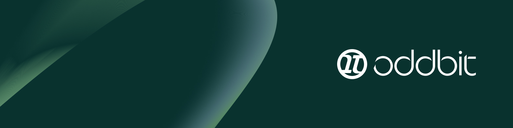

# 👋 Oh, hello there...

We're **Oddbit**, a software studio that’s small in size — but big on impact.  

We don’t just write code — we solve problems, engineer trust, and grow businesses.

We're based in Bali, perfectly positioned to bridge the gap between Asia and the West — for time zones, collaboration, and even the occasional onsite.  
With great connectivity and a team that values quality of life as much as quality of code, we deliver with clarity and calm.

> "We create better solutions — together."

## 🧠 Software Development by Humans, for Humans

Since 2017, we've helped tech teams and founders turn ideas into real, scalable products.  
Whether it's building from scratch, augmenting your team, or maintaining legacy systems — we get it done.

> “We believe in working *with* you, not *for* you.”

## 🚀 What We Do

- 🏗 **Technical Architecture & System Design** – future-proof, robust foundations.
- ⚙️ **Development & Maintenance** – full-stack engineering you can rely on.
- ✏️ **Rapid Prototyping** – test ideas fast, fail smart, and iterate well.
- 🎨 **UX & Branding** – connect your users with clear design and authentic tone.
- 🧭 **Workshops** – uncover your MVP, align on goals, and get moving fast.

We’re stack-agnostic, fluent in AWS, Azure, JavaScript, Java, C++, Flutter, and more. But above all, we speak *clarity* and *commitment*.

## 🤝 How We Work

- 🔄 **Flexible collaboration** — we fit into your process, not the other way around.
- 🤝 **Team extension** — your team is our team.
- 📈 **Long-term mindset** — Multi-year client relationships are our default, not the exception.
- 🧭 **Transparent ops** — daily check-ins, async-ready, globally aligned.
- ❤️ **We care** — the work matters, and we show it.

## 🔗 Let’s Connect

- 🌐 [www.oddbit.id](https://www.oddbit.id)
- ✉️ hello@oddbit.id
